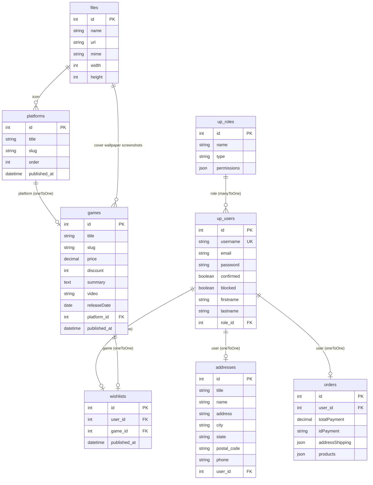

# Gaming — Backend (Strapi)

CMS headless y API REST del ecommerce de videojuegos. Es el **backend** del curso de Udemy *Next JS: Crea tu tienda online completa* (Agustín Navarro Galdón).

El frontend Next.js está en el repositorio hermano `[gaming-ecomerce-next](../gaming-ecomerce-next)`. Este proyecto expone el catálogo, usuarios, direcciones, wishlist, pedidos y el cobro con **Stripe**.

---

## Qué hace la aplicación

- Panel de administración Strapi para cargar **plataformas** y **juegos** (textos, precios, descuentos, media, trailers).
- API REST v4 (`/api/...`) para el storefront.
- Usuarios con **Users & Permissions** (registro, login JWT, perfil extendido con nombre y apellido).
- Content-types propios: Address, Wishlist, Order.
- Endpoint custom `POST /api/payment-order`: cobra con Stripe y persiste el pedido.

---


## Stack


| Tecnología                | Versión / detalle                                                       |
| ------------------------- | ----------------------------------------------------------------------- |
| Strapi                    | **4.6.2**                                                               |
| Node                      | `>=14.19.1 <=18.x.x` (ver `engines` en `package.json`)                  |
| Base de datos por defecto | **SQLite** (`better-sqlite3` 8.0.1), archivo `data.db`                  |
| Plugins                   | `@strapi/plugin-users-permissions`, `@strapi/plugin-i18n` (ambos 4.6.2) |
| Pagos                     | `stripe` ^17.2.0                                                        |


También hay configuración lista (sin usar por defecto) para **MySQL** y **PostgreSQL** vía `DATABASE_CLIENT` en `config/database.js`.

---


## Requisitos

- **Node 18** (Strapi 4.6 no soporta Node 20+ según `engines`).
- Yarn o npm.
- Para pagos: cuenta Stripe (modo test) y la **secret key** alineada con la publishable key del frontend.

---


## Instalación y arranque

```bash
yarn
# o
npm install
```

Copiá el entorno:

```bash
cp .env.example .env
```

Completá `.env` (ver más abajo) y generá claves reales para `APP_KEYS`, `API_TOKEN_SALT`, `ADMIN_JWT_SECRET` y `JWT_SECRET`.


| Script          | Comando                            | Descripción                      |
| --------------- | ---------------------------------- | -------------------------------- |
| Desarrollo      | `yarn develop` / `npm run develop` | Auto-reload, admin + API         |
| Producción      | `yarn start`                       | Sin auto-reload (`strapi start`) |
| Build del admin | `yarn build`                       | `strapi build`                   |
| CLI             | `yarn strapi`                      | Comandos Strapi                  |


Por defecto:

- Host: `0.0.0.0`
- Puerto: **1337**
- Admin: `http://localhost:1337/admin`
- API: `http://localhost:1337/api`

La primera vez, creá el usuario **Super Admin** en `/admin`.

---


## Variables de entorno

`.env.example`:

```
HOST=0.0.0.0
PORT=1337
APP_KEYS="toBeModified1,toBeModified2"
API_TOKEN_SALT=tobemodified
ADMIN_JWT_SECRET=tobemodified
JWT_SECRET=tobemodified
```

Usadas en código:


| Variable                                                                             | Dónde                    | Default       |
| ------------------------------------------------------------------------------------ | ------------------------ | ------------- |
| `HOST`                                                                               | `config/server.js`       | `0.0.0.0`     |
| `PORT`                                                                               | `config/server.js`       | `1337`        |
| `APP_KEYS`                                                                           | `config/server.js`       | (obligatorio) |
| `ADMIN_JWT_SECRET`                                                                   | `config/admin.js`        | —             |
| `API_TOKEN_SALT`                                                                     | `config/admin.js`        | —             |
| `JWT_SECRET`                                                                         | plugin users-permissions | —             |
| `DATABASE_CLIENT`                                                                    | `config/database.js`     | `sqlite`      |
| `DATABASE_FILENAME`                                                                  | sqlite                   | `data.db`     |
| `DATABASE_URL` / `DATABASE_HOST` / `PORT` / `NAME` / `USERNAME` / `PASSWORD` / `SSL` | mysql/postgres           | —             |
| `DATABASE_SCHEMA`                                                                    | postgres                 | `public`      |
| `DATABASE_POOL_MIN` / `MAX`                                                          | pool                     | 2 / 10        |
| `DATABASE_CONNECTION_TIMEOUT`                                                        | —                        | 60000         |
| `WEBHOOKS_POPULATE_RELATIONS`                                                        | server                   | `false`       |


`.env` está en `.gitignore`.

---


## Configuración

```
config/
  server.js       # host, port, APP_KEYS, webhooks
  admin.js        # JWT del panel, salt de API tokens
  database.js     # sqlite | mysql | postgres
  middlewares.js  # stack por defecto (errors, security, cors, body, …)
  api.js          # REST: defaultLimit 25, maxLimit 100, withCount true
```

No hay `config/plugins.js` ni `config/middlewares` custom: CORS y seguridad son los de Strapi. Uploads van a **disco local** (`public/uploads/`, ignorado en git salvo `.gitkeep`).

`src/index.js` no registra bootstrap ni jobs.

---


## Estructura

```
config/                         # servidor, DB, middlewares, API
src/
  api/
    game/                       # content-type + core CRUD
    platform/
    address/
    wishlist/
    order/                      # CRUD + ruta custom payment-order
  extensions/users-permissions/content-types/user/
  admin/                        # ejemplos (app.example.js, webpack)
public/                         # robots.txt, uploads
```

Los controladores/servicios/rutas de `game`, `platform`, `address` y `wishlist` son los **core factories** de Strapi (sin lógica extra). La personalización está en **Order**.

---


## Modelo de datos

Strapi 4: las respuestas REST vienen como `{ data: { id, attributes }, meta }`.

### Diagrama entidad-relación

Relaciones tal como están en los `schema.json` (todas **unidireccionales**, salvo User → Role). En SQLite/Postgres Strapi guarda el FK en la tabla origen (`games.platform_id`, `addresses.user_id`, etc.). Media (`icon`, `cover`, `wallpaper`, `screenshots`) no es un FK clásico: va a la tabla `files` vía la relación polimórfica `files_related`.

`orders.products` y `orders.addressShipping` son **JSON** (snapshot al pagar): no hay FK a Game ni a Address.




En el uso de la tienda, varios juegos pueden compartir plataforma y un usuario puede tener varias direcciones, varios favoritos y varios pedidos. El schema declara esas relaciones como `oneToOne` sin inversa; el storefront trata Wishlist como “una fila = un favorito”.

### Platform (`api::platform.platform`)


### Platform (`api::platform.platform`)

Collection `platforms`. Draft & publish: **sí**.


| Campo   | Tipo                     | Notas                                     |
| ------- | ------------------------ | ----------------------------------------- |
| `title` | string, required         |                                           |
| `slug`  | uid de `title`, required | Usado en `/games/[platform]` del frontend |
| `order` | integer, required        | Orden del menú (`sort=order:asc`)         |
| `icon`  | media imagen, required   | Icono del menú                            |


### Game (`api::game.game`)

Collection `games`. Draft & publish: **sí**.


| Campo         | Tipo                               | Notas                                       |
| ------------- | ---------------------------------- | ------------------------------------------- |
| `title`       | string, required                   |                                             |
| `slug`        | uid de `title`, required           | Ruta `/{slug}` en Next                      |
| `platform`    | oneToOne → Platform                |                                             |
| `price`       | decimal, required                  |                                             |
| `discount`    | integer                            | Porcentaje; puede ser vacío                 |
| `summary`     | text, required                     |                                             |
| `video`       | string, required                   | URL (YouTube u otro, la usa `react-player`) |
| `cover`       | media imagen, required             | Portada                                     |
| `wallpaper`   | media imagen, required             | Banner de ficha / home                      |
| `screenshots` | media imágenes, multiple, required | Galería                                     |
| `releaseDate` | date, required                     |                                             |


### Address (`api::address.address`)

Collection `addresses`. Draft & publish: **no**.


| Campo         | Tipo             |
| ------------- | ---------------- |
| `title`       | string, required |
| `name`        | string, required |
| `address`     | string, required |
| `city`        | string, required |
| `state`       | string, required |
| `postal_code` | string, required |
| `phone`       | string, required |
| `user`        | oneToOne → User  |


### Wishlist (`api::wishlist.wishlist`)

Collection `wishlists`. Draft & publish: **sí**.


| Campo  | Tipo            |
| ------ | --------------- |
| `user` | oneToOne → User |
| `game` | oneToOne → Game |


Una fila = un juego favorito de un usuario.

### Order (`api::order.order`)

Collection `orders`. Draft & publish: **no**.


| Campo             | Tipo              | Notas                                             |
| ----------------- | ----------------- | ------------------------------------------------- |
| `user`            | oneToOne → User   |                                                   |
| `totalPayment`    | decimal, required |                                                   |
| `idPayment`       | string            | ID del cargo Stripe                               |
| `addressShipping` | json, required    | Snapshot de la dirección elegida                  |
| `products`        | json, required    | Snapshot del carrito (objetos juego + `quantity`) |


El controller de pago también intenta guardar `status: 'pending'`, pero **ese campo no existe en el schema**.

### User (extensión de users-permissions)

Además de `username`, `email`, `password`, `confirmed`, `blocked`, `role`, etc.:


| Campo extra | Tipo   |
| ----------- | ------ |
| `firstname` | string |
| `lastname`  | string |


Archivo: `src/extensions/users-permissions/content-types/user/schema.json`.

---


## API REST

Prefijo: `/api`. Paginación por defecto: 25 (máx. 100). El frontend pide `populate` y `filters` de Strapi 4.

### Core (generadas)


| Método         | Ruta                 | Content-type |
| -------------- | -------------------- | ------------ |
| GET/POST       | `/api/games`         | Game         |
| GET/PUT/DELETE | `/api/games/:id`     | Game         |
| GET/POST       | `/api/platforms`     | Platform     |
| GET/PUT/DELETE | `/api/platforms/:id` | Platform     |
| GET/POST       | `/api/addresses`     | Address      |
| GET/PUT/DELETE | `/api/addresses/:id` | Address      |
| GET/POST       | `/api/wishlists`     | Wishlist     |
| GET/PUT/DELETE | `/api/wishlists/:id` | Wishlist     |
| GET/POST       | `/api/orders`        | Order        |
| GET/PUT/DELETE | `/api/orders/:id`    | Order        |


Filtros típicos que usa el frontend:

- Juegos por plataforma: `filters[platform][slug][$eq]=playstation`
- Búsqueda: `filters[title][$contains]=…`
- Ficha: `filters[slug][$eq]=…` + populate de wallpaper, cover, screenshots, platform.icon
- Direcciones / pedidos / wishlist por `filters[user][id][$eq]=…`


### Auth (plugin)


| Método | Ruta                       |
| ------ | -------------------------- |
| POST   | `/api/auth/local/register` |
| POST   | `/api/auth/local`          |
| GET    | `/api/users/me`            |
| PUT    | `/api/users/:id`           |


### Custom: pago

Definido en `src/api/order/routes/custom-order.js`:

```
POST /api/payment-order
handler: order.paymentOrder
```

Body que envía el frontend:

```json
{
  "token": { "id": "tok_…" },
  "products": [ { "id": 1, "attributes": { "price": 59.99, "discount": 10 }, "quantity": 2 } ],
  "idUser": 1,
  "addressShipping": { }
}
```

Lógica en `src/api/order/controllers/order.js`:

1. Recalcula el total con descuento × cantidad.
2. Crea un **Charge** de Stripe (`currency: USD`, `source: token.id`).
3. Valida y crea un registro `order` con productos, usuario, `idPayment`, dirección y `totalPayment`.
4. Devuelve la entrada creada.

La clave secreta de Stripe está **hardcodeada** en ese controller (modo test `sk_test_…`). Conviene moverla a `STRIPE_SECRET_KEY` en `.env`.

---


## Permisos (Users & Permissions)

No hay seeds en el repo. Hay que configurarlos en **Settings → Users & Permissions → Roles**. Sin esto, el frontend recibe 403.

Configuración habitual de este tipo de tienda:

**Public**

- Game: `find`, `findOne`
- Platform: `find`, `findOne`
- Auth: register / login (ya vienen del plugin)

**Authenticated**

- Lo de Public, más:
- Address: `find`, `create`, `update`, `delete`
- Wishlist: `find`, `create`, `delete`
- Order: `find`
- User: `me`, `update`
- Custom: habilitar `payment-order` (aparece bajo Order)

Ajustá find de Address/Wishlist/Order para que un usuario no liste datos de otros (el frontend filtra por `user.id`, pero el API no aplica una policy propia).

Confirmación de email: el schema tiene `confirmed` en `false` por defecto. Si el registro falla en el frontend, revisá en el plugin si “Enable email confirmation” está apagado (típico en el curso).

---


## Contenido para que el storefront funcione

1. Crear **plataformas** (título, slug, order, icono). El home de Next asume IDs: PlayStation `1`, Nintendo `2`, PC `3`, Xbox `4`.
2. Publicar **juegos** con cover, wallpaper, screenshots, video, precio, plataforma y slug.
3. Publicar entradas (draft & publish está activo en Game, Platform y Wishlist).

No hay datos de ejemplo versionados. Los uploads locales viven en `public/uploads/`.

---


## Relación con el frontend Next.js


| Frontend                       | Backend                                           |
| ------------------------------ | ------------------------------------------------- |
| `ENV.SERVER_HOST`              | Origen de este Strapi (hoy Railway en producción) |
| `ENV.API_URL`                  | `{host}/api`                                      |
| `ENV.STRIPE_TOKEN` (`pk_test`) | Debe ser el par de la `sk_test` de este proyecto  |
| Carrito en `localStorage`      | Solo se envía en `payment-order`                  |
| JWT en `localStorage`          | `Authorization: Bearer` en rutas autenticadas     |


El frontend concatenaba host + `url` de media. Con upload local, `url` suele ser `/uploads/...`.

Un deploy conocido (referenciado en el Next): `https://gaming-ecomerce-strapi-production.up.railway.app`.

Para local, el Next debe apuntar a `http://localhost:1337`.

---


## Plugin i18n

Está instalado (`@strapi/plugin-i18n`). Los content-types custom **no** declaran `pluginOptions.i18n` en sus schemas: el catálogo se trata como un solo idioma.

---


## Notas del código (estado del curso)

- En `paymentOrder`, `require('stripe')(secret)` no se asigna a una variable `stripe`, pero más abajo se llama `stripe.charges.create`. Eso puede romper el cobro hasta corregirlo (`const stripe = require('stripe')(process.env.STRIPE_SECRET_KEY)`).
- El cálculo usa `product.atributes` (typo); el frontend manda `attributes`. El total puede calcularse mal o fallar.
- Se envía `status` al crear la order y el schema no lo define.
- Cargos Stripe en **USD** (`charges.create`, API clásica de tokens). El frontend muestra algunos importes en ARS solo en la UI de pedidos.
- Secrets de Stripe en el repo: rotá las claves si este código se hizo público.
- SQLite es cómodo en local; en Railway u otro host suele usarse Postgres (`DATABASE_CLIENT=postgres` + `DATABASE_URL`).

---


## Despliegue

1. `yarn build` y `yarn start` (o el buildpack/Nixpacks de Railway).
2. Node 18.
3. Variables de `.env.example` + DB de producción.
4. Volumen o storage para `public/uploads` (si no, las imágenes se pierden en cada deploy).
5. Revisá CORS si el frontend no está en el mismo origen (middleware `strapi::cors` por defecto).

Documentación oficial de Strapi 4: [docs.strapi.io](https://docs.strapi.io).